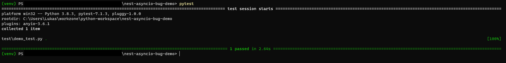
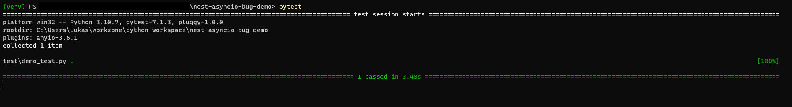

# Project for Demonstration of `nest_asyncio` Bug

This project serves for demonstration of the reported bug here
on [GitHub erdewit's nest_asyncio](https://github.com/erdewit/nest_asyncio/issues/74)

# Demonstration

## Setup Project with Python 3.8.3

* Create virtual environment with `python -m venv venv`
* Activate Environment (Note: I am running on Windows 10) with `.\venv\Scripts\activate`
* Install Requirements with `pip install -r requirements.txt`
* Execute Tests with `pytest`

Result:

## Setup Project with Python 3.10.7

* Create virtual environment with `python3 -m venv venv`
* Activate Environment (Note: I am running on Windows 10) with `.\venv\Scripts\activate`
* Install Requirements with `pip install -r requirements.txt`
* Execute Tests with `pytest`

Result:

As one can see, the execution does not return and keeps stuck after the test execution.
The expected behaviour is to return as it does with Python `3.8.3`.
